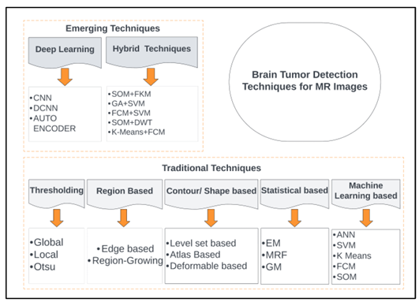
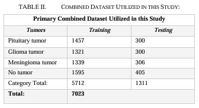
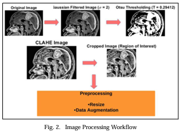
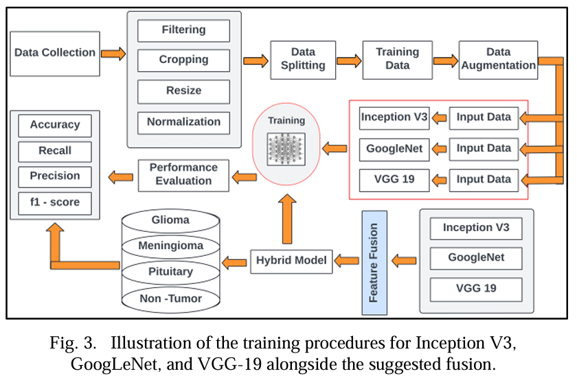

# 🧠 Advanced Brain Tumor Detection Using Deep Learning Techniques

Welcome to the repository for **"An Experimental Study on Brain Tumor Detection Using Deep Learning Techniques."** This project explores cutting-edge machine learning and deep learning methodologies to enhance the detection and classification of brain tumors.

## 📜 Abstract

The increasing incidence of brain tumors highlights an urgent need for precise diagnostic methods. This study introduces an innovative convolutional model to improve brain tumor identification accuracy. Using **Inception V3**, **GoogLeNet**, and **VGG-19** models, we meticulously evaluate each model’s performance in classifying brain tumor images, achieving remarkable results:

- **Inception V3:** 98.25% accuracy
- **GoogLeNet:** 95.36% accuracy
- **VGG-19:** 91.24% accuracy

Our novel approach utilizes **decision-level fusion** to combine outputs from multiple models, enhancing the robustness and accuracy of our detection system by leveraging the unique strengths of each model.

## 🌟 Key Features

- **Transfer Learning Techniques:** Leverages pre-trained models to improve performance.
- **Fusion-Based Approach:** Decision-level fusion aggregates diverse outputs for reliable tumor classification.
- **Advanced Image Processing:** Incorporates Otsu Thresholding and CLAHE to improve image quality and classification precision.

---

## 🧬 Tumor Types Addressed
This research encompasses a variety of tumor types, including:
- Meningiomas
- Gliomas
- Pituitary Tumors
- Malignant Tumors
- Medulloblastomas
- Lymphomas

---

## 📈 Model Performance Overview

| Model        | Accuracy (%) |
|--------------|--------------|
| Inception V3 | 98.25        |
| GoogLeNet    | 95.36        |
| VGG-19       | 91.24        |

---

## 📊 Datasets of Brain Tumors

The datasets used in this study are outlined below:

| **Name**               | **Description**                                                                                          | **Web Link**                                               |
|-------------------------|----------------------------------------------------------------------------------------------------------|-----------------------------------------------------------|
| **BRATS**              | Contains BRATS 2018, 2019, 2020, and 2021 datasets                                                      | [BRATS Segmentation](http://braintumorsegmentation.org/)   |
| **TCGA LGG**           | MRI scans: Around 500 T1-weighted and T2-weighted MRI                                                   | [TCGA Portal](https://www.cbioportal.org/)                |
| **Figshare**           | A smaller dataset with well-defined classes                                                             | [Figshare Dataset](https://figshare.com/)                 |
| **Harvard Medical**    | Includes a variety of specific data images                                                              | [Harvard Dataset](https://dataverse.harvard.edu/)         |
| **BrainWeb**           | 32 T1-weighted, 32 T2-weighted, 32 FLAIR, and 32 DTI volumes                                            | [BrainWeb](https://brainweb.bic.mni.mcgill.ca/)           |
| **OASIS**              | Structural MRI from 416 subjects                                                                        | [OASIS Dataset](https://www.oasis-brains.org/)            |

---

## 📷 Visualization

### Literature Review Classification

### Combined Dataset Utilized in this Study

### Image Pre-Processing Workflow

### Illustration of Training Procedure

---

## 🛠️ Technologies Used

- **Deep Learning Frameworks:** TensorFlow, Keras
- **Image Processing Techniques:** CLAHE (Contrast Limited Adaptive Histogram Equalization), Otsu Thresholding, Gaussian Filter
- **Fusion Technique:** Decision-level fusion for enhanced accuracy and robustness

---

## 📄 Full Paper Access

For the complete research paper, including detailed methodologies and results, visit the IEEE link below:  
[Access Full Paper on IEEE (Published Part of IIT-Mandi)](AN%20experimental%20study%20on%20Brain%20Tumor%20Detection.pdf) 🔗

---

## 💌 Contact

Chaitanya Sai Nutakki  
Department of Computer Science and Engineering,  
SRM University – AP, Andhra Pradesh, India  
✉️ Email: csnutakki@gmail.com  

---

